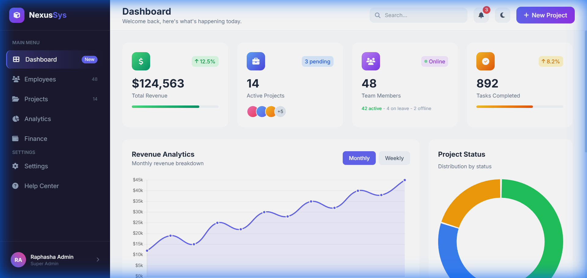

# NexusSys - Management System

A modern, responsive dashboard for managing employees, projects, and finances. Built with HTML5 and Tailwind CSS.

## Live Demo
View the live dashboard: [https://raphasha27.github.io/Management-System/](https://raphasha27.github.io/Management-System/)

## Features
- Real-time Stats Dashboard
- Employee & Team Management
- Finance & Revenue Overview
- Project Tracking with Status
- Real-time Notifications UI

## Tech Stack
- **HTML5**
- **Tailwind CSS** (via CDN)
- **FontAwesome** Icons
- **Google Fonts** (Outfit)

## Usage
Simply open `index.html` in your browser to view the dashboard locally, or visit the live demo link above.
