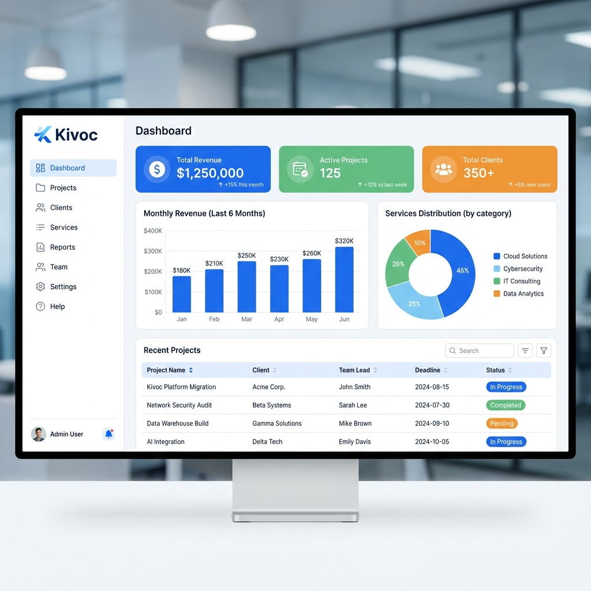

# 🚀 Kivoc Dynamic Technology - Management System

A professional, enterprise-grade management dashboard designed for **Kivoc Dynamic Technology**, an IT services and software solutions provider. This system streamlines project management, client relations, and service tracking.





## ✨ Features

- 🎯 **Project Management** - Track active projects, budgets, and timelines
- 👥 **Client Portal** - Manage client information and service history
- 🛠️ **Service Catalog** - Showcase IT services (Web Dev, Mobile Apps, Cloud)
- 📊 **Real-time Analytics** - Visual insights into revenue and project status
- 💬 **Call Center Agent** - Support ticket system with live chat interface
- 📋 **Ticket Management** - Track, respond to, and resolve customer queries
- 📱 **Mobile Responsive** - Fully functional on all devices with adaptive layout
- 🎨 **Corporate Identity** - Custom "Kivoc Blue" theme and professional branding
- 💰 **South African Pricing** - All services priced in Rand (ZAR)

## 🚀 Tech Stack

- **Frontend**: Next.js 16 (App Router), React 19, TypeScript
- **Styling**: CSS Modules with responsive design system
- **Backend**: Next.js Server Components & API Routes
- **Database**: Prisma ORM + SQLite (Ready for PostgreSQL)
- **Visualization**: Recharts for data analytics
- **Icons**: Lucide React

## 📦 Getting Started

### Prerequisites

- Node.js 18+
- npm or yarn

### Installation

1. **Clone the repository**
   ```bash
   git clone https://github.com/Raphasha27/Management-System.git
   cd Management-System/shop-master
   ```

2. **Install dependencies**
   ```bash
   npm install
   ```

3. **Initialize Database**
   ```bash
   npx prisma generate
   npx prisma migrate dev
   ```

4. **Start Development Server**
   ```bash
   npm run dev
   ```
   
   Visit [http://localhost:3000](http://localhost:3000)

## 🗂️ Project Structure

```
src/
├── app/                 # Next.js App Router pages
│   ├── page.tsx        # Main Dashboard
│   ├── globals.css     # Global styles & variables
│   └── layout.tsx      # Root layout with sidebar
├── components/          # Reusable UI components
│   ├── Sidebar.tsx     # Responsive navigation
│   ├── Charts.tsx      # Analytics charts
│   └── Header.tsx      # Application header
├── lib/                 # Utilities (Prisma client)
└── prisma/              # Database schema & seeds
```

## 🎨 Design System

**Primary Colors:**
- 🔵 **Primary**: `#2563EB` (Royal Blue)
- 💎 **Secondary**: `#3B82F6` (Sky Blue)
- 🟢 **Success**: `#10B981` (Emerald)
- 🟠 **Warning**: `#F59E0B` (Amber)

**Typography:**
- Font: Inter (Professional, Clean, Modern)

## 📊 Database Schema

Designed for IT Service Management:
- **Clients**: Companies and contact details
- **Projects**: Active contracts with budgets and timelines
- **Services**: Service catalog (Dev, Cloud, Design)
- **ProjectServices**: Link between projects and specific services

---

**© 2026 Kivoc Dynamic Technology**
*Empowering businesses with dynamic software solutions.*
